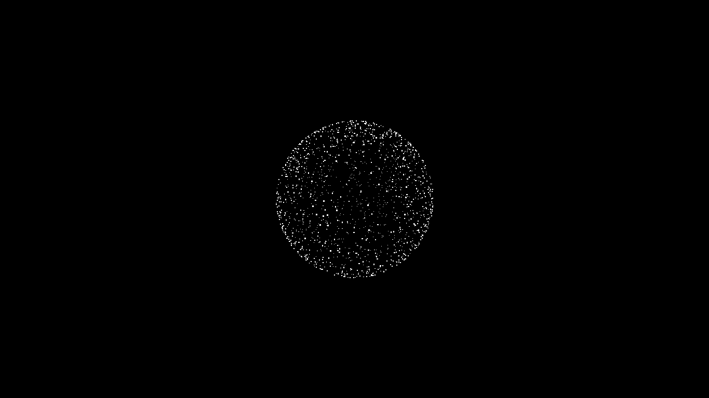
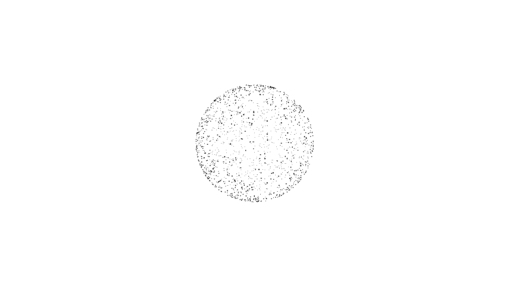

# VoiceOrb

A real-time, audio-reactive 3D particle visualization built with Angular and Three.js. VoiceOrb renders a sphere composed of thousands of particles that pulse and scale in response to your voice or ambient sound captured via the device microphone.

> **Reusable npm package** — [`@pank4ss/voice-orb-lib`](https://www.npmjs.com/package/@pank4ss/voice-orb-lib)  
> Drop `<lib-voice-orb></lib-voice-orb>` into any Angular 22+ standalone app.





## Demo

<video src="https://raw.githubusercontent.com/RayaneBICABA/voice-orb/main/demo.mp4" controls width="100%" poster="./Screenshot_1.png"></video>

## Features

- 3D particle sphere with 1,500 individually rendered points
- Real-time audio reactivity using the Web Audio API
- Smooth, continuous rotation for ambient visual effect
- Minimalist full-screen presentation
- Built with Angular standalone components and Tailwind CSS

## Tech Stack

| Technology | Purpose |
|---|---|
| Angular 22 | Web framework (standalone components) |
| Three.js | 3D rendering engine |
| Tailwind CSS 4 | Utility-first styling |
| Web Audio API | Microphone capture and audio analysis |
| Vitest | Unit testing |
| TypeScript | Language |

## Prerequisites

- Node.js (compatible with npm 10.9.8+)
- npm 10.9.8 or later
- A modern browser with Web Audio API and `getUserMedia` support
- A connected microphone

## Usage (as a library)

```bash
npm install @pank4ss/voice-orb-lib
```

```typescript
import { Component } from '@angular/core';
import { VoiceOrb } from '@pank4ss/voice-orb-lib';

@Component({
  selector: 'app-root',
  imports: [VoiceOrb],
  template: `<lib-voice-orb></lib-voice-orb>`,
})
export class AppComponent {}
```

> Requires Angular 22+ and three.js (`^0.185.1`) as peer dependencies.

## Getting Started (demo app)

```bash
# Clone the repository
git clone https://github.com/PANK4SS/voice-orb.git
cd voice-orb

# Install dependencies
npm install

# Build the library first
npm run build:lib

# Start the development server
npm start
```

Open your browser at `http://localhost:4200/` and allow microphone access when prompted.

## Available Scripts

| Script | Description |
|---|---|
| `npm start` | Start the development server with hot module replacement |
| `npm run build` | Build the demo app for production (output in `dist/voice-orb`) |
| `npm run build:lib` | Build the `@pank4ss/voice-orb-lib` library (output in `dist/voice-orb-lib`) |
| `npm run watch` | Build in watch mode for development |
| `npm test` | Run unit tests with Vitest |

## How It Works

The core visualization lives in a standalone Angular component that manages a Three.js scene. Upon initialization:

1. A Three.js scene is created with a black background, a perspective camera, and a 500x500 WebGL renderer.
2. 1,500 particles are positioned on the surface of a sphere (radius 2) using spherical coordinates.
3. The microphone is accessed via `getUserMedia` and connected to an `AnalyserNode` (FFT size 64).
4. An animation loop reads frequency data, computes the average volume (0-255), and scales the entire sphere proportionally (`scale = 1 + (volume / 255) * 0.6`).
5. The sphere rotates slowly on its Y-axis for subtle ambient motion.

## Project Structure

```
projects/
  voice-orb-lib/              # Reusable library (@pank4ss/voice-orb-lib)
    src/lib/
      voice-orb.ts            # Three.js scene, mic logic, animation loop
      voice-orb.html          # Canvas template
      voice-orb.css           # Component styles
    src/public-api.ts         # Library entry point (exports VoiceOrb)
    ng-package.json           # ng-packagr configuration
    package.json              # npm package metadata
src/                          # Demo application
  app/
    app.ts                   # Root component (consumes the library)
    app.config.ts            # Application configuration
    app.spec.ts              # Root component tests
    app.html                 # Root template
    app.css                  # Root styles
  index.html                 # Application shell
  main.ts                    # Bootstrap entry point
  styles.css                 # Global styles (Tailwind, background)
```

## Browser Support

Requires a browser that supports:

- WebGL
- `navigator.mediaDevices.getUserMedia`
- Web Audio API (`AudioContext`, `AnalyserNode`)

All modern browsers (Chrome, Firefox, Safari, Edge) are supported.
